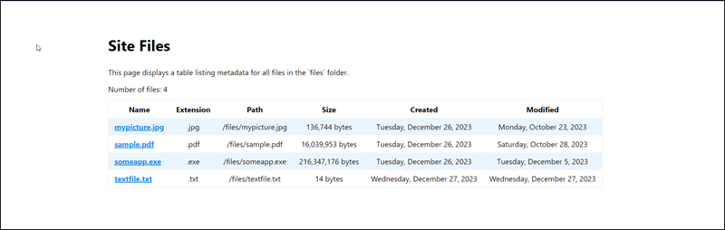

# Eleventy Plugin File List

An Eleventy Plugin that creates a collection containing metadata from a list of all files in a specified folder.

## Usage

Create a folder in your Eleventy project and populate it with the files you want to serve using this plugin. 

Next, in your Eleventy project's `eleventy.config.js` file, import the plugin as shown below:

```js
const fileList = require('eleventy-plugin-file-list.js');
```

Then, inside the `module.exports` section, load the plugin:

```js
eleventyConfig.addPlugin(fileList, { targetFolder: 'files' });
```

If you don't specify a target folder, the plugin assumes `files`.

```js
eleventyConfig.addPlugin(fileList);
```

To have the plugin process the target folder recursively, enable `doRecurse` when you load the plugin:

```js
eleventyConfig.addPlugin(fileList, { targetFolder: 'files', doRecurse: true });
```

The plugin supports a debug mode which sends additional information to the console during the build process. To enable debug mode, load the plugin with `debugMode` set to `true`:

```js
eleventyConfig.addPlugin(fileList, { targetFolder: 'files', debugMode: true });
```

The plugin uses the following default values for omitted configuration options:

* targetFolder: 'files'
* debugMode: false
* doRecurse: false

Ensure you pass through the contents of the folder:

```js
eleventyConfig.addPassthroughCopy('files/');
```

Here's a complete sample `eleventy.config.js` file:

```js
const fileList = require('eleventy-plugin-file-list.js');

module.exports = eleventyConfig => {

  const debugMode = false;
  const doRecurse = false;
  eleventyConfig.addPlugin(fileList, { targetFolder: 'files', debugMode, doRecurse });

  eleventyConfig.addPassthroughCopy('src/assets/');
  eleventyConfig.addPassthroughCopy('files/');

  return {
    dir: {
      input: 'src',
      output: '_site',
      includes: '_includes',
      layouts: '_layouts',
      data: '_data'
    }
  }
};
```

## Rendering File Metadata

The data collection created by the plugin is called `fileList` and it contains the following file properties:

* `name`
* `extension`
* `path`
* `fileSize`: File size in bytes
* `created`: Create date
* `modified`: Modified date

Here's a sample table created from the plugin's output:

```liquid
This page displays a table listing metadata for all files in the `files` folder.


  <p>Number of files: {{ collections.fileList.length }}</p>
  <table>
  <tr>
    <th>Name</th>
    <th>Extension</th>
    <th>Path</th>
  </tr>
    
    <tr>
      <td><a href="{{ file.path }}" target="_blank">{{ file.name }}</a></td>
      <td>{{ file.extension }}</td>
      <td>{{ file.path }}</td>
    </tr>
  
</table>  

  <p>No file data to display</p>

```

## Demonstration

This repository contains a demo Eleventy site that demonstrations the plugin's capabilities. To run the demo, clone this repository to your local development system, then execute the following steps:

1. Create a folder in the cloned project folder called `files`.
2. Copy some files into the newly created folder
3. Open terminal window and navigate to the project folder
4. execute `npm install`
5. execute `npm start`

At this point, Eleventy will build the project and display a link you can click to view the sample page (http://localhost:8080 as shown in the text below):

```shell
D:\dev\11ty\eleventy-plugin-file-list>npm start

> eleventy-plugin-file-list@0.0.0 start
> tsc && eleventy --serve

[Eleventy-Plugin-File-List] Building file list from the projects's "files" folder
[Eleventy-Plugin-File-List] Duration: 0.516ms
[Eleventy-Plugin-File-List] Completed building file list, found 4 files
[11ty] Writing _site/index.html from ./src/index.liquid
[11ty] Copied 7 files / Wrote 1 file in 0.24 seconds (v2.0.1)
[11ty] Watching…
[11ty] Server at http://localhost:8080/
```



*** 

If this code helps you, please consider buying me a coffee.

<a href="https://www.buymeacoffee.com/johnwargo" target="_blank"></a>
